## EEGPT: UNLEASHING THE POTENTIAL OF EEG GENERALIST FOUNDATION MODEL BY AUTOREGRES- SIVE PRE-TRAINING  
### EEG foundation model using Autoregressive Pre‑Training

First author: Tongtian Yue$^{1,2}$  
Corresponding author: Jing Liu$^{1,2}$  
Affiliation: Zidongtaichu Foundation Model Research Center$^1$ & School of Artificial Intelligence, University of Chinese Academy of Sciences$^2$

---

## Table of Contents  

1. Background & Problem Setting
2. Novelty of This Study
3. Proposed Method (ETE & TEG) and materials
4. Experimental Results 1 to 4
5. Discussion & Limitations
6. Conclusion

---
layout: two-cols
---

## 1a. What is EEG? 🧠　〰︎　〰︎

- It is the abbreviation of electroencephalogram
- Non‑invasive measurement of brain electrical activity using **scalp electrodes**
- Applied for estimating emotion / motor imagery / mental workload / sleep‑stage

## 2a. Novelty of This Study ✨

- **Autoregressive (AR) pre‑training** applied to EEG for the first time
- 1 B+ tokens (signal embeddings) used to verify **scaling laws**
- **Task‑shared Electrode Graph (TEG)** allows transfer to 5 tasks × 12 benchmarks **with a single model**

::right::

## 1b. Challenges in Research ⚠️

- **Heterogeneous experiment formats** (number & placement of electrodes, etc.)
- **MAE‑style preprocessing** dominates and struggles to capture temporal dependency
- Existing models are **task‑specific**

## 2b. Outcomes 🎯

- **EEGPT‑Giant (1.09 B params)** surpasses specialised models by **5–11 %** → Result 1
- Demonstrated scaling laws: larger model size & more data improve performance → Result 2
- Robust AR performance against unexperienced EEG data → Result 4

---

## 🏗 3a. Overall Architecture

- **ETE**: Autoregressive pre‑training for each electrode’s time series (leftside the architecture)
- **TEG**: Learns spatial crostalks between electrodes and performs multi‑task **transfer fine‑tuning** (rightside)  

  

    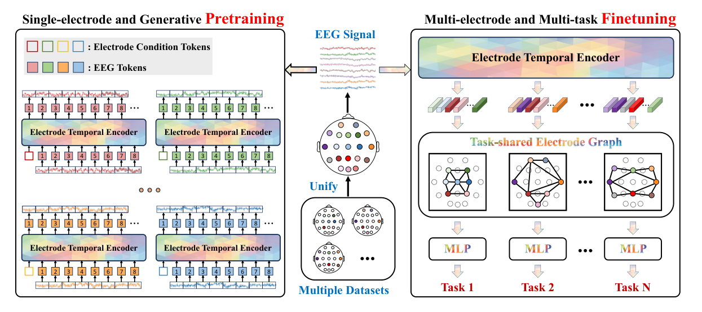
  

  

    Figure. 3
  

⚠️ Datasets were split into 8:1:1 for train/val/test. Results were obtained using 5 random seeds.

---

## 3b. Electrode Temporal Encoder (ETE): 概要  
| *Objective* | Obtain EEG representations involving chronological information |
|:--:|:--:|
| *Input* | 1‑second EEG window $x$ per electrode |
| *Tokenised Input* | Embedded vectors $X$ (electrode labels + signals concatenation) |
| _Q K V_ | $\mathbf{Q}=\mathbf{X}W_Q,\; \mathbf{K}=\mathbf{X}W_K,\; \mathbf{V}=\mathbf{X}W_V$ |
| _Attention_ | $\mathrm{softmax}\Bigl(\tfrac{\mathbf{Q}\mathbf{K}^\top}{\sqrt{d}} + M\Bigr)\mathbf{V}$ |
| _Loss_ | $\mathcal{L}=\tfrac{1}{T}\sum_{t=1}^{T}(x_t-\hat{x}_t)^2$ （$MSE$）|

> **Simple Example**\
> Input a 4‑dimensional series `[0.1, 0.0, −0.2, ?]` and predict the last point “?”.\
> Mask $M$ enforces that each timestep refers **only to the past**, enabling autoregressive representation learning.

---

## 3b. Electrode Temporal Encoder (ETE) simple ver

- **Input**: EEG signals forming each electrode ($E$) × 1 s window ($C$) × time series ($T$) 
- **Objective**: **Per‑electrode** autoregressive prediction through capturing temporal evolution implemented with a causal attention mechanism
 
> **Causal attention $\alpha$**:  $\displaystyle \alpha_{t,s}=\mathrm{softmax}\!\bigl(\tfrac{\mathbf{q}_t\mathbf{k}_s^\top}{\sqrt{d}}+M_{t,s}\bigr)$ （$M_{t,s}=-\infty$ if $s>t$）
 

$$
\underbrace{\begin{bmatrix}q_1\\ q_2\\ q_3\end{bmatrix}}_{\mathbf{Q}}
\;\times\;
\underbrace{\begin{bmatrix}k_1^\top & k_2^\top & k_3^\top\end{bmatrix}}_{\mathbf{K}^\top}
=
\begin{bmatrix}
q_1k_1^\top & q_1k_2^\top & q_1k_3^\top \\
q_2k_1^\top & q_2k_2^\top & q_2k_3^\top \\
q_3k_1^\top & q_3k_2^\top & q_3k_3^\top
\end{bmatrix}
\Rightarrow \;\mathrm{softmax}_{\text{row}} \;\Rightarrow \mathbf{\alpha}
$$

$$
\displaystyle \mathbf{z}_t=\sum_{s\le t}\alpha_{t,s}\mathbf{v}_s
$$

> **Meaning of α**: $\alpha_{t,s}$ is the weight indicating “how much the Query at time *t* attends to past step *s*”. If $q_t$ seeks a “small‑amplitude EEG pattern” and $k_s$ contains it, their inner product increases, $\alpha_{t,s}$ grows, and time *t* attends to *s*.  
> **Weighted Update**: $z_t$ merges past information into the token representation.

---
layout: two-cols
---

## 3c. Overview of TEG  

- **Purpose**: Utilise tokens condensed with past signal information, adding spatial context

- **Input**: __Last__ time‑series features $z_j \in \mathbb{R}^{E_j \times C}$ extracted by ETE

- **Processing**: **Graph attention** – learn inter‑electrode relationships (go next slide)

- **Output**: Tokens with spatiotemporal information → Task‑specific heads (classification / regression)

- **Loss**: MSE

::right::

  

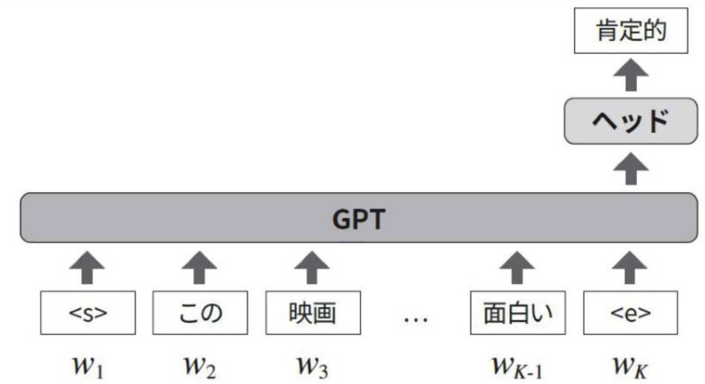

図3.2 - 大規模言語モデル入門 より

---
layout: two-cols
---

## 3c. TEG Overview 

### Graph Attention (modified from Eq. 9)
  1. Map the time‑series features $h_m$ and $h_n$ of electrodes $m$ and $n$ with $W$, concatenate column‑wise to obtain $h_{m,n}$ 

  2. Linear projection with $b h_{m,n}$ 

  3. Activation → softmax to compute attention score $\alpha$ between electrodes. 

  4. Vector $h'_m$ capturing spatial info for electrode $h'_m = \sum_{n \in \mathcal{N}(m)} \alpha_{mn} W h_n$ 

  5. Pool $h'$ and feed into task‑specific head.  

<small>⚠️ $b$ and $W$ are learned jointly across tasks. 
⚠️ Pooling method was not clarified
</small>

::right::

### Simple example

  

 

  ##### Red Edge: connection between used electrodes (F3 & P3)

```mermaid
graph LR
  C(("C3<br/>[0, 0, 0]<sup>T</sup>"))
  F(("F3<br/>[1, -0.3, 2]<sup>T</sup>"))
  P(("P3<br/>[-1, 4, 0]<sup>T</sup>"))

  C --- P
  F --- C
  F --- P

  %% 各リンクのスタイル指定（0から順番に）
  linkStyle 0 stroke:#dddddd,stroke-width:2px
  linkStyle 1 stroke:#dddddd,stroke-width:2px
  linkStyle 2 stroke:#e74c3c,stroke-width:4px
```

$$
\mathbf{b} \times
\underbrace{
\begin{bmatrix} W \times F_3\\ W \times P_3\end{bmatrix}
}_{h_{F_3,P_3}} \quad
- in \quad 1, 2
$$

$$
h'_{F_3} = \alpha_{F_3,F_3} W h_{F_3} + \alpha_{F_3,P_3} W h_{P_3} \quad
- in \quad 4
$$

---
layout: two-cols
---

## 3d. Datasets Used

##### Preprocessed data: 37.5 M samples → 1 B tokens

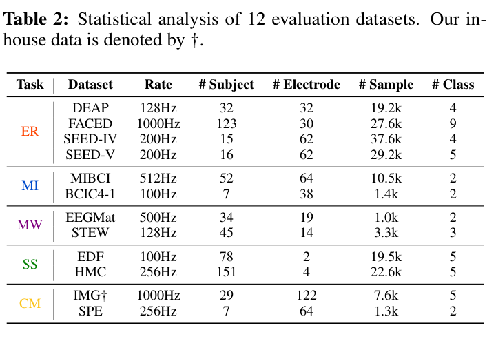

<small>⚠️ The sample # counting and the tokenisation method are unclear. (Prior work, BIOT, used frequency components as tokens)</small>

::right::

#### Dataset Overview 

<small>

| タスク名                      | タスク内容概要 + 例                      |
| :---: | :---: |
| ER; Emotion Recognition  | Classify emotions (joy, sadness, fear, etc.) |
| MI; Motor Imagery        | Classify imagined movement (left/right hand imaginary movement) |
| MW; Mental Workload      | Estimate cognitive load (low vs high, e.g, during rest vs subtraction task) |
| SS; Sleep Stage          | Classify sleep stages (Wake/N1/N2/N3/REM) |
| CM; Cross-Modality | Cross‑modal ERP tasks (classify categories of viewed images) |

</small>

---
layout: two-cols
---

## 3d. ML Models Used

- EEGPT models & parameter sizes

  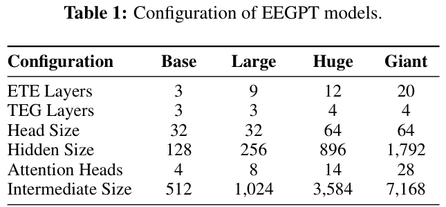

- Convergence of autoregressive pre‑training ✔️

  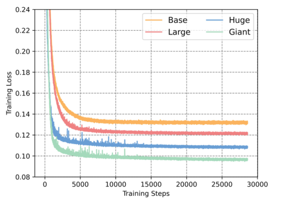
  

    Figure. 4a
  

::right::

- Competing models trained per task

<small>

| **EEGNet** (2018)    | Depthwise + Separable CNN                         | BCI: P300, ERN, SMR, etc.                        |
| :---: | :---: | :---: |
| **TSception** (2022) | Multi‑scale temporal CNN + asymmetric spatial CNN | Emotion (valence/arousal)                        |
| **Conformer** (2023) | 1D CNN + Self‑Attention                           | Motor imagery, emotion, etc.                     |
| **LGGNet** (2023)    | Local & Global GNN by functional regions          | Attention, fatigue, emotion                      |
| **BIOT** (2024)      | MAE × channel‑wise tokenisation             | Pre‑training → seizure detection                 |
| **LaBraM** (2024)    | VQ tokeniser + MAE              | Cross‑task transfer: abnormal EEG, emotion, etc. |

</small>

---
layout: two-cols
---

## 4. Result 1: EEGPT Outperforms

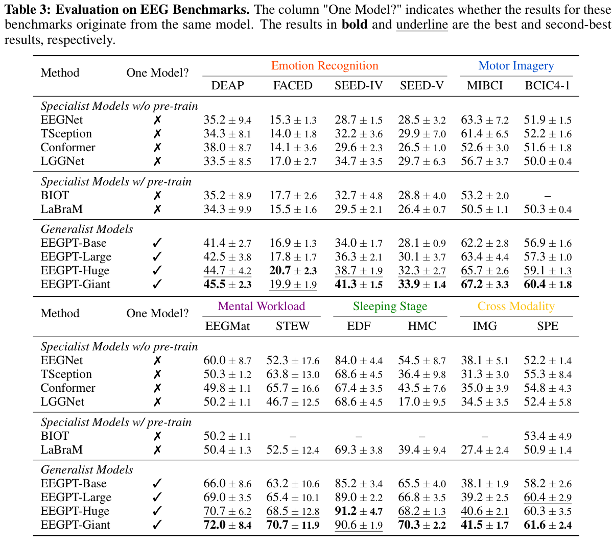

::right::
## &nbsp;Specialised Models

  

    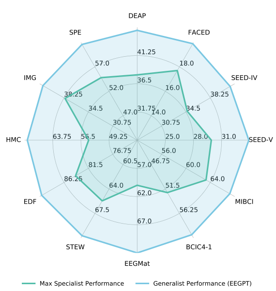
  

Figure. 1

  <small>
    5 ~ 11% improvement in accuracy on average across the tasks   
    ER task: avg. 5% ↑ 
    SS task: avg. 11% ↑
  </small>

---

## 4. Result 2: Demonstration of Scaling Laws

- Increasing model parameters improves performance

  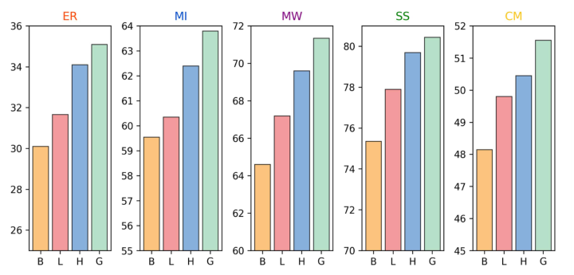
  

    Figure. 4b
  

- Increasing data size for AR pre‑training further boosts performance → suggests room for improvement

  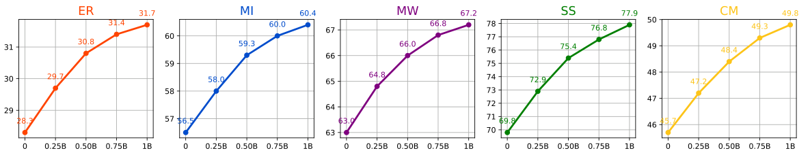
  

    Figure. 5
  

---
layout: two-cols
---

## 4. Result 3: AR & TEG utility

- Regarding pre‑training
  - Compare MAE vs AR, the mainstream for EEG analysis using Transformers

  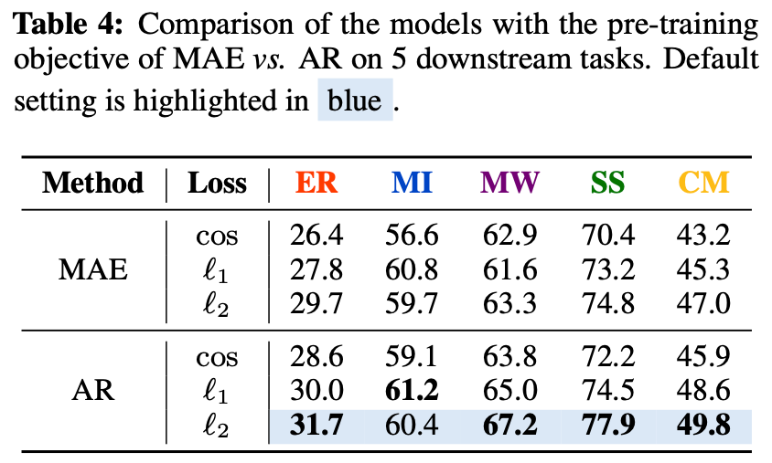

- AR pre‑training, which learns chronological dependency, achieves the higher performance  
- AR can replace conventional MAE for EEG analysis

::right::

- Regarding fine‑tuning
  - Compare training per task vs joint training (share electrode graphs; TEG) across all tasks

  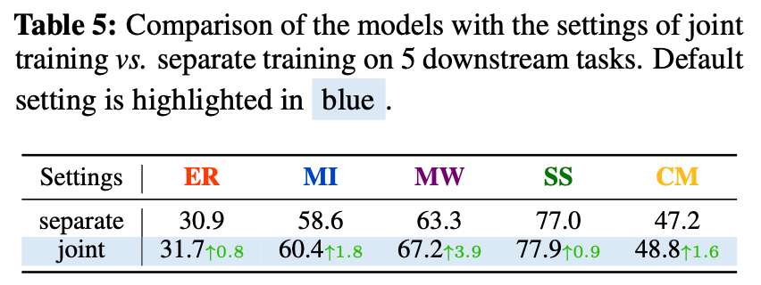

- Joint learning consistently improves performance, even for tasks with limited data. i.e., task MW: 4K tokens, whereas task SS: 42K tokens
- The multi‑task setup of EEGPT is effective and promising for future EEG analysis.

---

## 4. Result 4: Learned AR Representations on Unseen Data

- Dataset: DREAMER
  - Subjects: 23 participants
  - Task: emotion recognition
  - Labels: 4‑class (valence high/low × arousal high/low)
- Procedure
  - Feed EEG signals into ETE, take the last token per electrode
  - Mean‑pool and visualise samples with t‑SNE

  

    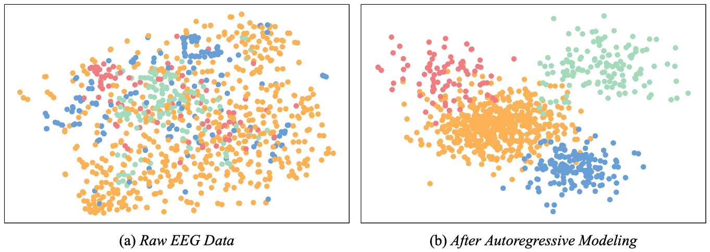
  

  

    Figure. 6
  

---

## 🧵 Conclusion

- Achieved creation of a **general EEG analysis model** ✔️
- Confirmed in EEG the scaling laws and utility of AR, which are also reported in NLP field ✔️
- **Multi‑task learning** via a shared electrode graph enhances performance ✔️

  

## 🧐 Limitations

1. **EEG tokens?**: The signal → token conversion method is not specified.
1. **Positional encoding?**: Is positional encoding unnecessary for AR?
1. **Importance of TEG?**: If AR alone yields good latent representations (Fig. 6), how crucial is TEG for tasks?
1. **No proving**: Unclear which chronological domains are important for feature extraction and/or label classification.

---

# supplementary information 👉

---

# See Full PDF  

[📝 View Full PDF](./pdf/hoge/EEGPT.pdf)

---
layout: two-cols
---

## SwiGLU 

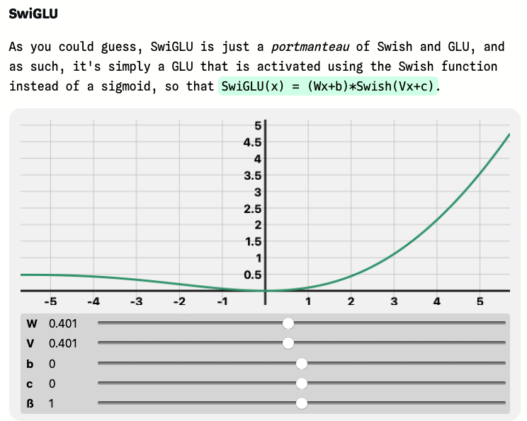

jcarlosroldan.com

::right::

## Leaky ReLU 

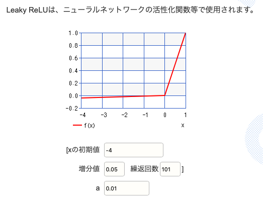

keisan.casio.jp

---
layout: two-cols
---

## Positional encoding matrix (PEM) 

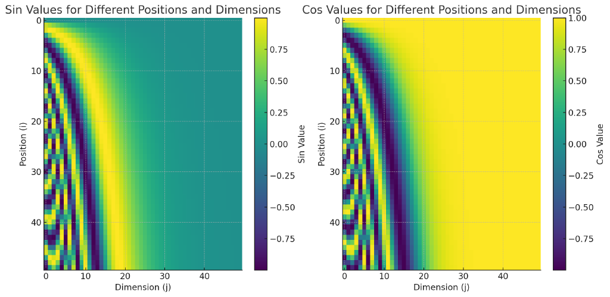

M1KE BLOG

::right::

## Inner product of PEM 

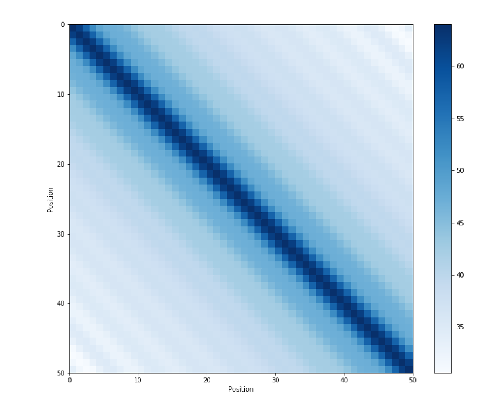

M1KE BLOG

